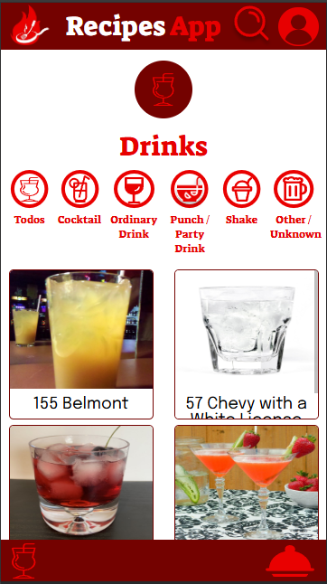

## Descrição:

**Recipes App** é um app de receitas, utilizando o que há de mais moderno dentro do ecossistema React: Hooks e Context API!
O projeto consiste em desenvolver um sistema que permite visualizar, buscar, filtrar, favoritar, compartilhar e acompanhar o processo de preparação de receitas e drinks. A base de dados serão 2 APIs distintas, uma para comidas e outra para bebidas.
O layout tem como foco dispositivos móveis, então todos os protótipos vão estar desenvolvidos em telas menores.

## API Consumida

Este projeto consome duas APIs externas para obter dados de refeições e coquetéis:

- [TheMealDB](https://www.themealdb.com/api.php)
- [TheCocktailDB](https://www.thecocktaildb.com/api.php)

### Endpoints utilizados

#### TheMealDB

- `https://www.themealdb.com/api/json/v1/1/search.php?s={nome}`: Busca por refeições pelo nome.
- `https://www.themealdb.com/api/json/v1/1/filter.php?i={ingredient}`: Filtre as refeições por ingredientes.
- `https://www.themealdb.com/api/json/v1/1/search.php?f={firstLetter}`: Filtre as refeições pela primeira letra.
- `https://www.themealdb.com/api/json/v1/1/list.php?c=list`: Busca todas as categorias de refeições.
- `https://www.themealdb.com/api/json/v1/1/filter.php?c={category}`: Filtre as refeições pela categoria. 
- `https://www.themealdb.com/api/json/v1/1/lookup.php?i={id}`: Obtém detalhes de uma refeição pelo ID.

#### TheCocktailDB

- `https://www.thecocktaildb.com/api/json/v1/1/search.php?s={nome}`: Busca por coquetéis pelo nome.
- `https://www.thecocktaildb.com/api/json/v1/1/filter.php?i={ingredient}`: Filtre os coquetéis por ingredientes.
- `https://www.thecocktaildb.com/api/json/v1/1/search.php?f={firstLetter}`: Filtre os coquetéis pela primeira letra.
- `https://www.thecocktaildb.com/api/json/v1/1/list.php?c=list`: Busca todas as categorias de coquetéis.
- `https://www.thecocktaildb.com/api/json/v1/1/filter.php?c={category}`: Filtre os coquetéis pela categoria.
- `https://www.thecocktaildb.com/api/json/v1/1/lookup.php?i={id}`: Obtém detalhes de um coquetel pelo ID.

### Como utilizar

1. Substitua `{nome}`, `{ingredient}`, `{firstLetter}`, `{category}` ou `{id}` pelos parâmetros desejados.
2. Faça uma requisição GET para o endpoint correspondente.
3. Utilize os dados retornados para exibir as informações na interface do usuário.

### Observações

- As respostas das APIs são em formato JSON.
- Não é necessário autenticação para utilizar os endpoints mencionados.
- Considere implementar tratamento de erros para lidar com possíveis falhas nas requisições.

Para mais detalhes sobre os endpoints e parâmetros disponíveis, consulte a documentação oficial de cada API.

---

Esta abordagem fornece informações claras sobre os endpoints consumidos, facilitando a compreensão e utilização do projeto por outros desenvolvedores.

## Sobre o projeto:

### O que foi desenvolvido:

Foi desenvolvido, um projeto que simula um aplicatio de receitas, onde é possivel visualizar, buscar, filtrar, favoritar, compartilhar e acompanhar o processo de preparação de receitas de comidas e bebidas.

O layout do app foi feito de acordo com o link do figma abaixo.

Figma: https://www.figma.com/design/nfmbY2U28bs1GnW3wysCzA/-Projeto--Frontend--Recipes-App---Personal-Project?node-id=0-1&p=f&t=BCmGh5WMZNysf0oM-0

No app foram criadas 6 telas, são elas: 

| Login | Receitas Concluídas | Receitas Favoritas | Perfil | Comidas |
|:-----:|:-------------------:|:------------------:|:------:|:-------:|
|  |  |  |  |  |
| Bebidas | Detalhes de Comida | Detalhes de Bebida | Progresso de Comida | Progresso de Bebida |
|  |  |  |  |  |


As telas de "Meals In Progress e Drinks In Progress" permitem ao usuário acompanhar o progresso da receita, marcando os ingredientes conforme são preparados. O estado é mantido mesmo após atualizar a página, utilizando o localStorage com a chave inProgressRecipes .

O aplicativo consome as APIs públicas do TheMealDB e TheCocktailDB para obter dados de receitas e drinks.

## Instalação:
Para a configuração do projeto, siga os seguintes passos:

Clone o Repositório:

```bash
git clone git@github.com:FabioRodriguesT/project_recipes_app.git
cd project_recipes_app
```

Instale as dependências:

```bash
npm install
```

### Utilizando a API:

Você pode executar a API utilizando npm.
Utilizando npm

Para executar a API, use o seguinte comando:

```bash
npm run start
```

Você pode então acessar a API em http://localhost:3000 (ou utilizando sua porta específica).

### Rotas disponíveis:

| Rota                         | Funcionalidade                                               |
|:----------------------------:|:-----------------------------------------------------------:|
| `/`                          | Exibe a tela de login do aplicativo                         |
| `/meals`                     | Exibe todas as receitas de comidas                          |
| `/drinks`                    | Exibe todas as receitas de bebidas                          |
| `/profile`                   | Exibe o perfil do usuário                                   |
| `/done-recipes`              | Exibe todas as receitas já realizadas                       |
| `/favorite-recipes`          | Exibe todas as receitas favoritas                           |
| `/meals/{id}`                | Exibe os detalhes de uma receita de comida pelo **ID**      |
| `/drinks/{id}`               | Exibe os detalhes de uma receita de bebida pelo **ID**      |
| `/meals/{id}/in-progress`    | Exibe o progresso de uma receita de comida pelo **ID**      |
| `/drinks/{id}/in-progress`   | Exibe o progresso de uma receita de bebida pelo **ID**      |

## Teste

## Dependências

### Dependencias:

- camelcase
- http-status-codes
- jsonwebtoken
- puppeteer
- uuid

### Depêndencias de Desenvolvimento:

- jest-dom
- react
- user-event
- axios
- jest
- mocha
- mysql2
- nyc
- sequelize
- sequelize-cli

Licença:

Este projeto é licenciado sob a Licença MIT. Boa codificação!

